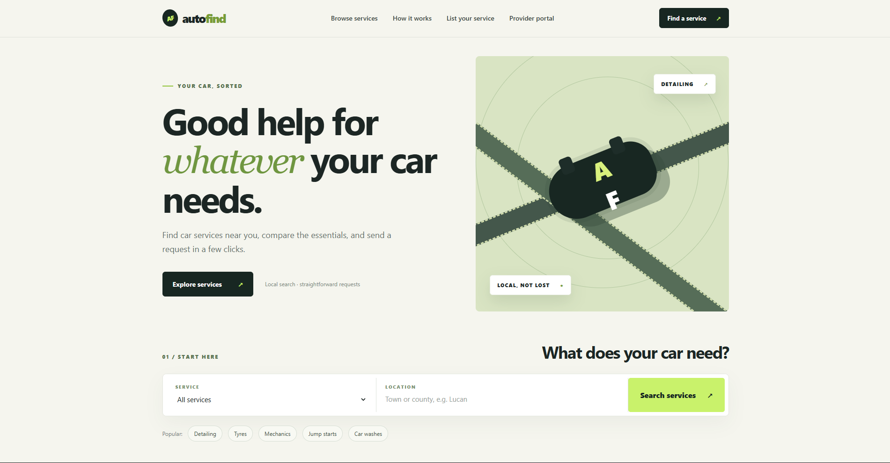
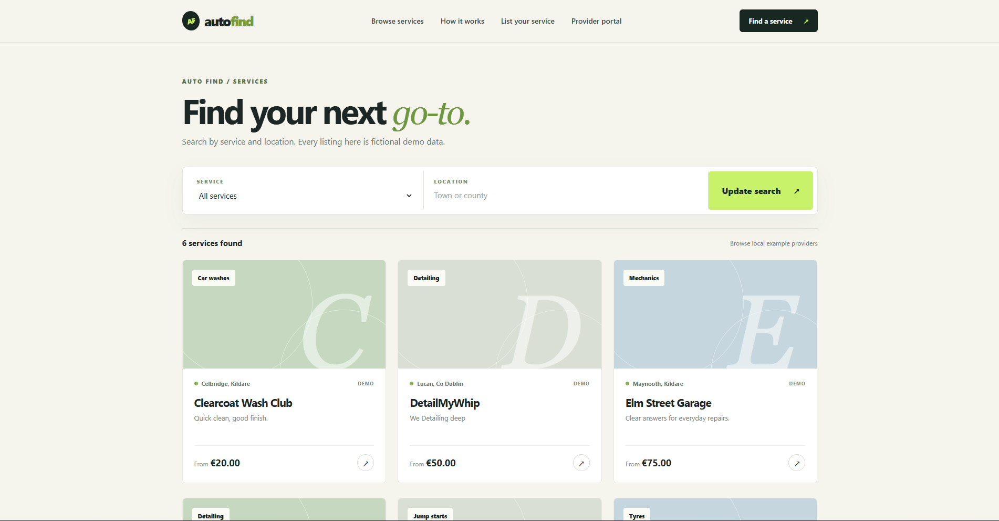
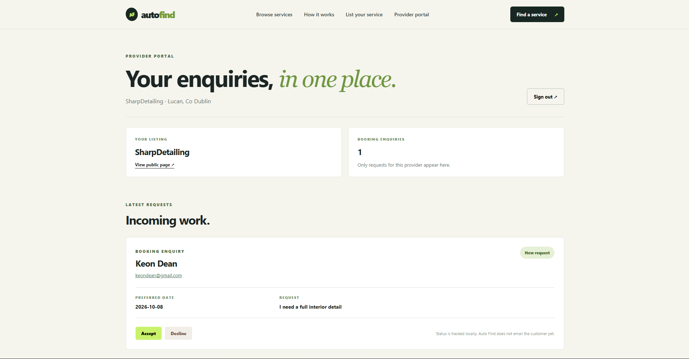

# Auto Find

Auto Find is a Java web app for finding local car services. The idea is to bring garages, detailers, tyre shops, car washes and mobile help into one place instead of searching for each service separately.

Customers can filter listings by service and area, view a provider's details and send a booking enquiry. Providers can create an account, publish a listing and manage the requests sent to them.

**This is a local demo.** The five starter listings are fictional. Requests are stored on your computer; the app does not contact businesses or email customers.

## Screenshots







## What it does

- Searches by service category and part of a town or county.
- Shows a provider profile with its location, description and starting price.
- Validates the booking form, including the email and preferred date, before saving a request.
- Lets providers register, sign in and accept or decline enquiries on their own dashboard.
- Keeps listings and requests in a local H2 database between restarts.

## Built with

Java 21 · Spring Boot · Spring MVC · Thymeleaf · Spring Data JPA · Spring Security · H2 · Maven · JUnit/MockMvc

## Run locally

You need **Java 21**. The project includes the Maven wrapper, so you do not need to install Maven separately.

1. Open the project folder containing `pom.xml` in VS Code.
2. In the VS Code terminal, run:

   ```powershell
   .\mvnw.cmd spring-boot:run
   ```

3. Open [http://localhost:8081](http://localhost:8081).

To try the full flow, search for **Detailing** in **Lucan**, then use **List your service** to create a demo provider account. Open your new listing in another tab and send it a booking request. Sign in to the provider dashboard to accept or decline that request.

The database file `autofind-db.mv.db` is created next to `pom.xml`. It is excluded from Git. Stop the app with **Ctrl+C**.

## How the code fits together

| Part | Main files | Job |
| --- | --- | --- |
| Web pages | `AutoFindController`, `ProviderPortalController`, `templates/` | Handle pages and form submissions |
| Business logic | `ProviderService`, `BookingService`, `ProviderAccountService` | Search listings, save enquiries and manage accounts |
| Data | `Provider`, `ProviderAccount`, `Booking`, repository interfaces | Store listings, accounts and enquiries |
| Security | `SecurityConfig` | Protect provider pages and hash passwords with BCrypt |
| Example data | `SampleData` | Add five fictional listings to an empty database |

A provider can change a booking's status only when the booking belongs to that provider. `BookingService` checks **both the booking ID and the signed-in provider's ID** before updating it; hiding another provider's booking in the UI alone would not be enough.

## Tests

Run the tests from the folder containing `pom.xml`:

```powershell
.\mvnw.cmd test
```

`BookingFlowTests` covers search, invalid dates, saving a request and viewing its confirmation. `ProviderPortalTests` covers registration, password hashing, login and the check that prevents a provider from changing someone else's enquiry. GitHub Actions runs the tests on pushes to `main`.

## Current limits

Auto Find runs locally with example listings. It does not send emails, verify businesses, take payments or provide a public deployment. A useful next step would be notifying customers when a provider responds to their request.
